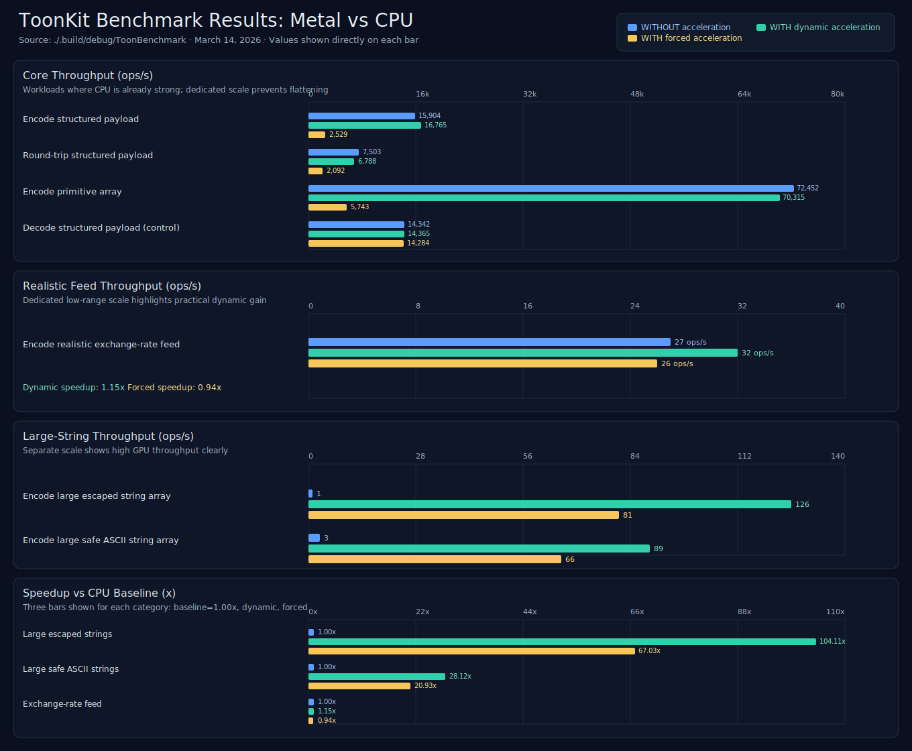

# ToonKit

High-performance Swift implementation of [TOON](https://github.com/toon-format/spec) (Token-Oriented Object Notation), built for production Apple-platform workloads.

ToonKit delivers two core advantages:

- **Lower LLM token footprint**: TOON typically reduces token usage by **30–60% vs JSON**.
- **Adaptive high-throughput serialization**: optional Metal acceleration with runtime gating for large string-heavy workloads.

## Executive Summary

ToonKit is positioned for teams shipping AI and data-intensive features on Apple platforms that need both cost efficiency (token reduction) and runtime performance (high-throughput encoding).

### KPI Snapshot (Measured)

| Metric | Result |
|---|---:|
| Token reduction vs JSON | **30–60%** |
| Peak measured dynamic speedup | **104.11x** |
| Large safe ASCII string workload speedup | **28.12x** |
| Decode control impact | **~1.00x** (no regression) |

Measured on macOS arm64 using `swift run ToonBenchmark` (March 14, 2026).

## Why Teams Adopt ToonKit

- **Reduces inference cost pressure** by compressing structural verbosity before prompts reach model context windows.
- **Improves throughput where it matters** with acceleration focused on heavy string serialization paths.
- **Maintains operational safety** through adaptive gating (uses Metal only when faster on the current machine/workload).
- **Integrates cleanly** with Swift `Codable`, enabling low-friction adoption in existing codebases.

## Performance Results

Run the benchmark:

```bash
swift run ToonBenchmark
```

Benchmark modes:

- **WITHOUT acceleration**
- **WITH dynamic acceleration** (Metal only when measured faster)
- **WITH forced acceleration** (forced Metal path for explicit A/B analysis)

### WITH Metal vs WITHOUT Metal



| Benchmark | WITHOUT acceleration (ops/s) | WITH dynamic acceleration (ops/s) | WITH forced acceleration (ops/s) | Dynamic speedup | Forced speedup |
|---|---:|---:|---:|---:|---:|
| Encode structured payload | 15,904 | 16,765 | 2,529 | 1.05x | 0.16x |
| Round-trip structured payload | 7,503 | 6,788 | 2,092 | 0.90x | 0.28x |
| Encode primitive array | 72,452 | 70,315 | 5,743 | 0.97x | 0.08x |
| Encode large escaped string array | 1 | 126 | 81 | **104.11x** | 67.03x |
| Encode large safe ASCII string array | 3 | 89 | 66 | **28.12x** | 20.93x |
| Encode realistic exchange-rate feed | 27 | 32 | 26 | 1.15x | 0.94x |
| Decode structured payload (control) | 14,342 | 14,365 | 14,284 | 1.00x | 1.00x |

### Interpretation for Production

- **Best-fit acceleration profile**: biggest gains appear in large batched string encoding with escaping/quoting overhead.
- **Predictable safety behavior**: dynamic mode avoids forcing GPU paths that underperform on mixed or smaller workloads.
- **Operational recommendation**: use dynamic mode in production and reserved forced mode for benchmarking or hardware characterization.

## Installation

Add ToonKit with Swift Package Manager:

```swift
.package(url: "https://github.com/Benny-Nottonson/ToonKit.git", from: "1.0.0")
```

Or in Xcode: **File → Add Packages…** and paste the repository URL.

## Quick Start

```swift
import Toon

struct User: Codable, Equatable {
    let id: Int
    let name: String
    let tags: [String]
}

let user = User(id: 1, name: "Ada Lovelace", tags: ["coding", "maths"])

let encoder = ToonEncoder()
let data = try encoder.encode(user)
// id: 1
// name: Ada Lovelace
// tags[2]: coding,maths

let decoder = ToonDecoder()
let decoded = try decoder.decode(User.self, from: data)
assert(decoded == user)
```

## Format at a Glance

```toon
name: Ada Lovelace
age: 36
active: true
score: 9.8
email: null

tags[3]: coding,maths,logic

address:
  street: 1 Math Lane
  city: London

orders[2]{id,amount,status}:
  1001,49.99,shipped
  1002,12.50,pending
```

## Production Controls

### Encoder Configuration

```swift
let encoder = ToonEncoder()

encoder.indent = 4
encoder.delimiter = .tab // or .comma, .pipe

encoder.negativeZeroStrategy = .preserve
encoder.nonFiniteFloatStrategy = .null
// .throw
// .convertToString(positiveInfinity: "Infinity", negativeInfinity: "-Infinity", nan: "NaN")

encoder.keyFolding = .safe
encoder.limits = ToonEncoder.Limits(maxDepth: 64)

encoder.acceleration = .metal(minimumStringByteCount: 16_384)
// encoder.acceleration = .metalForced(minimumStringByteCount: 1)

print(ToonEncoder.isMetalAccelerationAvailable)
print(ToonEncoder.isMetalAccelerationEnabled)
```

### Decoder Configuration

```swift
let decoder = ToonDecoder()

decoder.expandPaths = .automatic
// .safe
// .disabled

decoder.limits = ToonDecoder.Limits(
    maxInputSize: 10 * 1024 * 1024,
    maxDepth: 32,
    maxObjectKeys: 10_000,
    maxArrayLength: 100_000
)
```

### Metal Backend Behavior

- Metal acceleration is **optional** and **off by default**.
- Dynamic acceleration enables GPU only when ToonKit measures a net benefit.
- CPU fallback remains available for workloads where GPU dispatch is not advantageous.
- `metalForced` exists for deterministic A/B comparisons and profiling.
- Current acceleration scope targets batched string serialization workloads.

## Foundation Type Support

| Swift Type | TOON Representation |
|---|---|
| `Date` | ISO 8601 string (`2023-11-14T22:13:20Z`) |
| `URL` | Bare URL string (unquoted when safe) |
| `Data` | Base64 string |

```swift
struct Asset: Codable {
    let url: URL
    let createdAt: Date
    let thumbnail: Data
}
```

## Error Handling

```swift
do {
    let value = try decoder.decode(MyType.self, from: data)
} catch let error as ToonDecodingError {
    switch error {
    case .invalidFormat(let msg):
        print("Parse error:", msg)
    case .typeMismatch(let exp, let got):
        print("Expected \(exp), got \(got)")
    case .keyNotFound(let key):
        print("Missing key:", key)
    case .inputTooLarge:
        print("Input too large")
    default:
        print("Decoding error:", error)
    }
}
```

## Platform Requirements

| Platform | Minimum Version |
|---|---:|
| iOS | 16.0 |
| macOS | 13.0 |
| watchOS | 9.0 |
| tvOS | 16.0 |
| visionOS | 1.0 |

Swift 5.9+ required.

## Specification

Implements **TOON specification 3.0** (2025-11-24).  
Spec: https://github.com/toon-format/spec

## Repository Layout

```
Sources/Toon/
├── Toon.swift
├── Value.swift
├── Errors.swift
├── Encoder.swift
├── Decoder.swift
└── Internal/
    ├── Shared/
    ├── Metal/
    ├── Parsing/
    ├── Serialization/
    └── Codable/
```

### Internal Metal Modules (Encoding)

- `MetalStringLiteralEncoder.swift`: orchestration layer for batch string encoding.
- `MetalStringAccelerationPolicy.swift`: acceleration heuristics and threshold policy.
- `MetalStringSpeedGate.swift`: adaptive runtime benchmark gate for dynamic mode.
- `MetalStringAccelerator.swift`: Metal pipeline setup and kernel dispatch.
- `MetalStringAnalyzer.swift`: CPU-side ASCII flag interpretation fallback.
- `Shared/StringLiteralRules.swift`: shared literal classification/escaping rules used by CPU and Metal paths.

### Internal Shader Modules

- `Shaders/ToonStringShaderCommon.metal`: shared flag constants and helper routines.
- `Shaders/ToonStringClassifyPrimaryKernel.metal`: primary character-classification kernel.
- `Shaders/ToonStringClassifyAlternativeKernel.metal`: alternative classification kernel for large inputs.
- `Shaders/ToonStringEncodeRangesKernel.metal`: range-based string encoding kernel.

## License

MIT — see [LICENSE](LICENSE).
